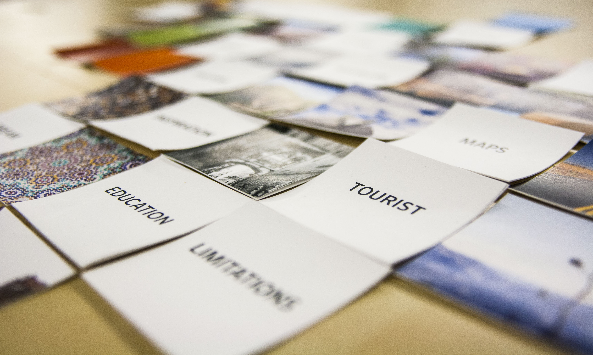
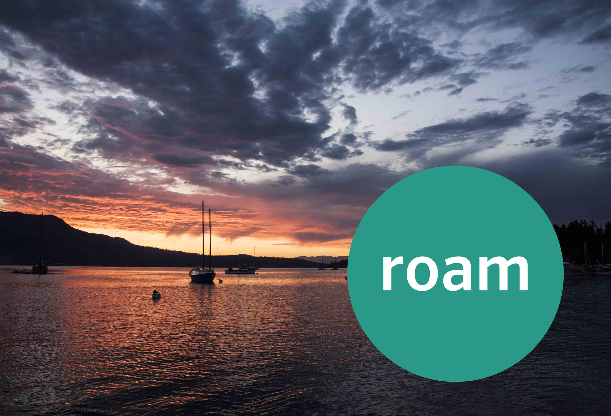

roam is a system and service design solution that is brought to life through a mobile application, a website and a small print component. The primary goal of roam is to encourage people to travel in alternative ways that do not follow the same cookie cutter routes, especially in terms of exploring smaller towns and communities, discovering amazing places that are actually off the beaten path and reintroducing a sense of adventure into international travel. I chose this design space due to my own life-long relationship to travel and the largely untapped potential that exists as more and more young people travel, but miss out on life-changing opportunities due to fear of the unknown. Basically the system plans a travel route for you based on a set of parameters that you input, however it does not tell you your complete journey at the outset, it just gives you the first stop and a general area guide. Once you reach your destination, you check in, and it gives you the next destination, and so on. There are options built into the system to encourage environmental awareness, alternative modes of transportation, community involvement and a travel buddy program, and the system uses elements of gamification to guide the structure of the system.

I settled on the idea fairly early in the project, however I wanted to make sure my solution made sense, and was the most effective, empathetic and meaningful way to address the problem. Thus far I have focused primarily on research, especially primary research, although I have also explored many lenses of secondary research as well, including scientific and statistical contexts, such as the physical, anthropological, social, and psychological relationships to travel, as well as design-based research such as service design, gamification, UI design, and mobile-first design.

<figure class="figure--aside">

<figcaption>Cocreation activity to identify visual and verbal patterns.</figcaption>
</figure>

My primary research has included an empathy experiment where I was asked to navigate a foreign city that I had never been to, in a language I didn't speak, in a culture that is vastly different from myself, and having to trust someone to make sure I had an interesting and safe journey. I was surprised at the willingness of people to be helpful, as well as the false confidence that fore planning had instilled in me in my other travel experiences. By the end of the experiment I was thoroughly mentally exhausted, but also incredibly triumphant.

<figure class="figure--aside">

<figcaption>The visual aesthetic of roam will focus heavily on photography and clean design </figcaption>
</figure>

The second primary research investigation I went through was an online survey that was open for three weeks and collected 130 responses from a wide range of ages, demographics and nationalities. The survey focused on motivations for travel, memorable travel experiences and general openness to alternative types of travel experiences. After an initial analysis, I am happy to report that roam satisfies many of the insights gained in the research, and is flexible enough to accommodate many of the other insights I had not foreseen. A good example of this is that many people's most memorable travel experiences was when they took a risk, when they wandered off the path that they were supposed to be following and interacted with local communities, so that was an exciting discovery. I was also happy to confirm that a second demographic, outside of the first one I identified (18-30 with some international travel experience and an openness to new ideas), also exists in the form of those that are 50+ who have also had some international travel experience and are less tied to responsibilities at home. This second demographic was suggested to me by one of the travel expert bloggers that I interviewed as part of my research, and so I was pleased to see that the survey confirmed that many in this category were also open to the idea of travelling without knowing exactly where they were going. At this point in my project I am working on a second level analysis of the survey results, as well as beginning to analyze the co-ccreation sessions I have been running for the past week, and then I will be reflecting those changes in the design of the system and preparing for our Mid-Project presentations! Although my process has been heavily research-based so far, it is a fairly large project, and I feel that the research will be, and has been, the most important component to this success of this project.
