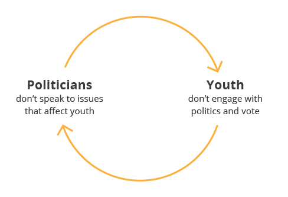

> __Claire:__ Why is politics boring to you? 
__Research Participant:__ Because it is.

Claire and I found that of all the reasons why youth don’t engage with politics, the top reason they is, simply, politics is boring. We then probed deeper into why specifically politics are boring for youth, and found that the lack of personal relevancy is one of the key reasons.

When we asked our research participants whether politics seems relevant to their lives, they said:

> I’m more or less happy with my life, not really looking to change any aspect, therefore change or lack of, in politics, doesn’t really seem to affect me.  
> Specifically, it doesn’t affect me as directly. Or I just don’t take enough interest  
> They are not very relevant to my interests, for the most part.

From these responses, we can see quite clearly that unless youth perceive that they are personally affected by politics, they don’t see it as relevant to their lives, and therefore see it as boring. So if politics supposedly affects everyone’s personal lives, why does it seem irrelevant and therefore boring to youth in particular? Claire and I offer a few reasons as to why we think that is.

## Politicians don’t speak to issues for youth

<figure class="figure--aside figure--border">

<figcaption>
The cycle.
</figcaption>
</figure>

As Pia Mancini puts it so bluntly,

> We are 21st-century citizens, doing our very, very best to interact with 19th century-designed institutions that are based on an information technology of the 15th century.

<figure class="figure--breakout">

  <iframe async defer src="https://embed-ssl.ted.com/talks/pia_mancini_how_to_upgrade_democracy_for_the_internet_era.html" width="560" height="315" frameborder="0" scrolling="no" webkitAllowFullScreen mozallowfullscreen allowFullScreen></iframe>

<figcaption>
Pia Mancini’s <abbr>TED</abbr> Talk.
</figcaption>
</figure>

No youth I know besides the very few are jumping up and down to go to town hall meetings, lobby in Ottawa, or canvassing during elections season. It’s inconvenient, it’s doesn’t always promise a chance for your voice to be heard, and it’s out of date (despite these methods being one of the only ways to officially participate politically). 

 This is in contrast to our thriving online world of user-generated content, where almost anyone has the ability to express their opinions, feelings, and perceptions through Facebook posts, tweets, or youtube videos. The youth I know who care about things are not running around to town hall meetings to express their views and chasing candidates down to hear about the latest bill—they’re blogging/vlogging/tweeting/facebooking/instagramming online about their opinions and views, and using the same mediums to receive their news events as well.

Where some might call this slacktivism, I see slacktivism just as a symptom of improper infrastructure to support youth participation in the political system. Youth are definitely participating online, but these actions aren’t recognized as ones that have any political impact. A functioning democratic system should be one that listens to their citizens. In today’s modern age, that requires being engaged with social media and technology. The information technology we use for our political system needs to catch up, or else youth will never see politics as relevant to their interests and lives.

Recently in Vancouver’s municipal elections, the three main candidates [Gregor Robertson](http://www.reddit.com/r/vancouver/comments/2k4jme/im_gregor_robertson_mayor_of_vancouver_running/), [Kirk LaPointe](http://www.reddit.com/r/vancouver/comments/2jfpmn/i_am_kirk_lapointe_intensely_running_for_mayor_of), and [Meena Wong](http://www.reddit.com/r/vancouver/comments/2jt9cs/i_am_meena_wong_cope_candidate_for_mayor_of/) all took to Reddit for an <abbr title="Ask Me Anything">AMA</abbr> (ask me anything) discussions. Gregor Robertson also participated in live tweeting the day before the election to answer any last questions his followers had. I see this as a step in the right direction to take politics to where the citizens are, rather than expecting the citizens to go where the politics are. However, we need to do more than this if we want to get youth participating in politics. A technologically-appropriate participatory approach&nbsp;needs to be more than once every four years on reddit, and take the form of something&nbsp;built into our&nbsp;political system.

## Next Steps

Needless to say, bringing politics to youth rather than always asking youth to go to politics is something that Claire and I will have to incorporate into our design solution. We need utilize the potential of design and technology to reframe politics into something that is relevant, interesting, and important. However, we recognize that whatever we do will only be one piece of the puzzle—we need our political system to start engaging with youth through technology. If this generation of youth don’t engage, how will future generations of youth who grow up with more emerging technology ever engage as well?

### But for now, I’d love to hear from you guys…

- Do you think the political system is doing enough to engage youth? Why or why not?
- What are your thoughts on the role of technology in civic participation?
- What are your preferred forms of participation with politics?

<footer>
This article was [original posted](http://cheryliprocess.com/research/apathy-is-boring-but-so-is-politics/) on Cheryl & Claire’s blog, where they write about [youth voting and civic engagement in Canada](http://cheryliprocess.com/).
</footer>
