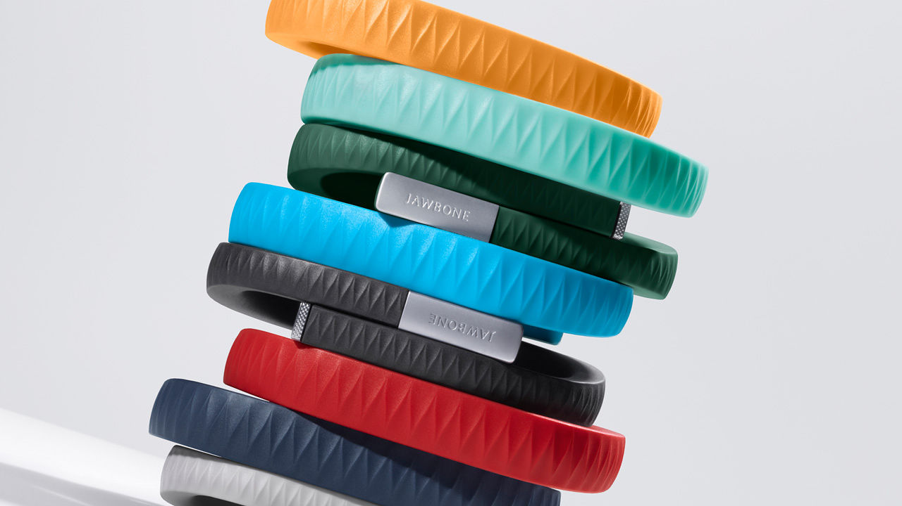

If I were asked to recall my first experience with a smartphone, I would likely describe my astonishment of such a feature rich and seemingly sci-fi-esque device. I would not have, however, suggested any notion of a possible exhaustion from the prevalence of such technology in our day-to-day lives, eventually becoming intrusive to the point of provoking a desire to leave my phone at home for just one day.

Developments in computer technology is transforming consumer products at an immense—almost intimidating—pace, and in turn, transforming the way we socialize, consume, produce, work, play, and identify ourselves. As a communication designer, I believe that I have a responsibility to clearly communicate ideas in order to adapt, respond, and contribute to such a technological change and its effects on our cultural landscape.

<figure class="figure--aside">

<figcaption>UP, released in 2011 by Jawbone, a San Francisco-based consumer electronics. This wearable device is a wristband that allows the wearer to track his or her biometric information and utilize apps that allow the wearer to use social-networking services, and also record and provide access to health and fitness related information, among others. It is available in a variety of colours.</figcaption>
</figure>

Applying this belief to my undergraduate thesis project, I observed the developing role of wearables as it relates to branding and visual identities. Wearable technology and devices (simplified to _wearables_) are accessories or garments that incorporate computers and electronic devices (such as combinations of sensors, screens, and lights, among many others), enhancing or extending functionality and allowing wearers [a more direct form of interface with smart devices](http://www.wearabledevices.com/what-is-a-wearable-device/). Existing products include Google’s optical head mounted display, Google Glass, and Ralph Klein’s biometric _smartwear_, Ohm Signal. Wearable products can exist in many contexts; they may function as a tool to increase productivity, act as an aid in healthcare by monitoring patient health, allow us to interact with each other and ourselves in new ways, provide new avenues for entertainment, or used as a form of expression through fashion or artwork. Having experienced a boost in mainstream coverage thanks to the Apple Watch, wearables are now considered the “next big thing” by many, and have become a valuable target for brands who wish to secure a role in the next technological paradigm.

<figure class="figure--aside">

<figcaption>Google Glass is an optical head-mounted display that provides capabilities similar to smartphones. It runs on Google’s Android OS and features a touchpad, a camera, an app capabilities and, of course, supports open source development.</figcaption>
</figure>

In its fertile state, it is important for us to wonder: In what ways will brands contribute to (and exploit) our values, perceptions, and consumption habits in the retail market space of wearables? While this is important to consider for any new product, I find the potential future of wearables particularly distressing. Many businesses (and consumers) are approaching this space with naïveté, looking to profit from the novel sentiment of sci-fi before addressing major concerns that go hand-in-hand with the assimilation of technology into a mass market, eg.; How will we sustainably dispose of electronics that are embedded into fabrics? Should they be principally designed as aesthetic garments or as utilitarian smart devices, or should they attain to be visible at all? To what extent should we trust our devices and the brands we wear to record and share about our bodily data at all times? What should we or should we not expect from wearables in the future? All of these issues are, in one way or another, affected by or considered in brand identities, which I see potential in through its ability to connect to consumers and act as a vehicle for a cohesive brand message.

The aim of my project is to design a system to express and clarify these important considerations so as to lay the foundation for an innovative, sustainable, practical, and publicly cognizant paradigm. With a comprehensive understanding of the aforementioned issues, there is an opportunity to utilize trendspotting methodologies to deeply analyse and speculate wearables and its ties to brand identities: First I will observe branded language and experiences, popular media, public perceptions, aesthetic trends, design practices, technological and sociological developments, as well as other cultural aspects that surround wearables throughout history. I can use this information to test hypothesized scenarios and project into the future contemporary trends dealing with wearable technology and branding. Then, using this information, design and publish a narrative that provides a better understanding of wearables and our society to an audience of primarily early adopting consumers, business owners, and cultural producers who hold vital roles in the wearables product space.
Using a combination of communication design formats to broadcast this speculative narrative (ex. publication design, social media, product packaging, interactive, and visual identity), there is an opportunity to offer insight and meaningful communication to consumers, encouraging a re-thinking of what we truly want out of our wearable technology in the coming future, promoting an innovative and sustainable future in wearable design, and planting the seeds for a product space that contributes to social good and progress.

## References

- http://www.fastcodesign.com/3019157/innovation-by-design-conference/the-invisible-future-of-wearables-according-to-jawbone
