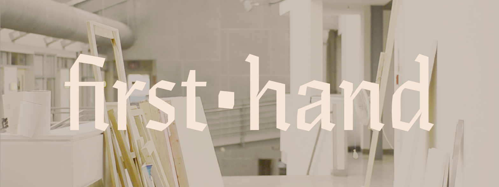

<q>What’s one thing you wish you knew before starting your grad project?</q> It’s a question students tend to wonder as their final year of study draws closer—and this was no exception for the artists, designers, and writers at Emily Carr University of Art + Design.

We decided the best way to find an answer would be to ask previous and present classmates [first hand](http://askfirsthand.com): hence, the name of this publication.

During the last week of classes, my friend and collaborator Geoff Campbell and I interviewed animators, ceramicists, photographers, writers, designers, and more, during their final week of study and preparation for [The Show](http://theshow.ecuad.ca/2014/home).

<figure class="figure--aside figure--border">
  
  <figcaption>The South Building, where Kenneth Ormandy and Geoff Campbell filmed many of the interviews.</figcaption>
</figure>

This year, we’re starting earlier: our classmates and friends will each be writing one blog post on their area of study for their project.

## What’s in a grad project

In our final year, we primarily focus on a single, year-long capstone project—we’re not in grad school, but colloquially refer to it as our _grad project_. It’s probably closer to an undergraduate thesis.

## With that in mind

With that in mind, I
