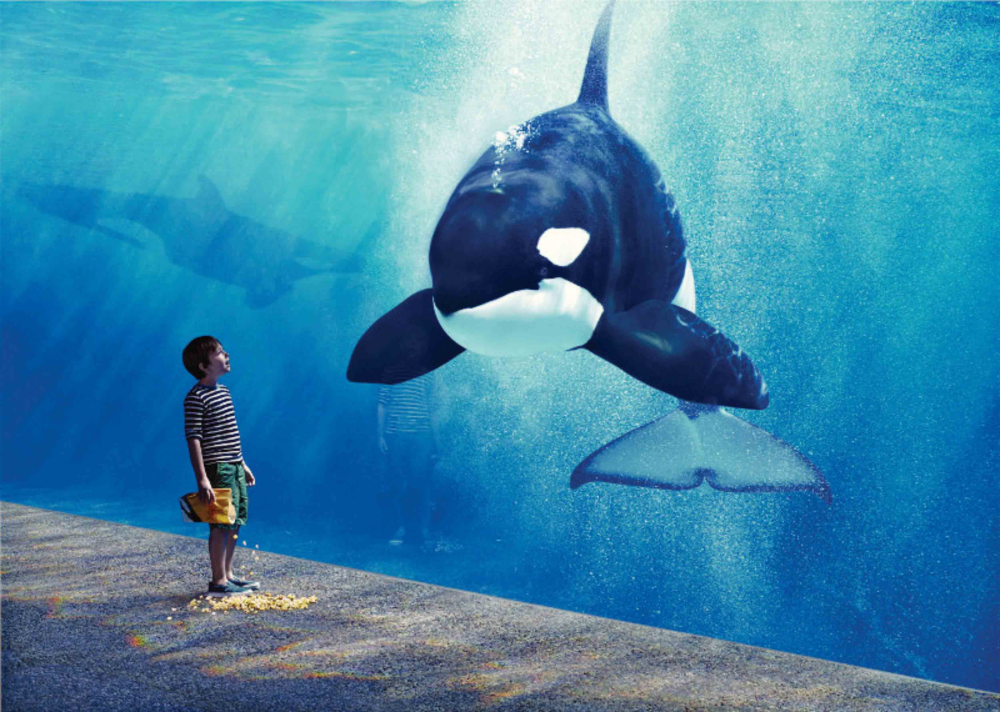
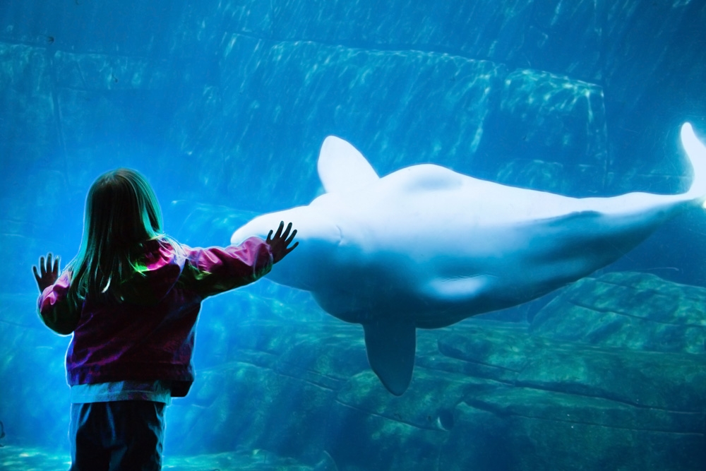

For those of you who didn’t get the chance to watch Blackfish, I surely recommend you to watch it. In summary, the documentary is builds up to narrate the psychological effects of captivity towards killer whales through signs of aggression and also death. It’ll be safe to say that after watching that documentary, it creates a negative perception towards the aquarium.

<figure>

<iframe src="http://www.youtube.com/embed/fLOeH-Oq_1Y?modestbranding=1&showinfo=0&autohide=1&color=white&theme=light" frameborder="0" allowfullscreen></iframe>

<figcaption>The <cite>Blackfish</cite> trailer.</figcaption>
</figure>

Vancouver Aquarium, our local, non-profit aquarium was deeply affected by this documentary. Many activists, including Mayor Gregor himself, demands the Vancouver Aquarium to release the cetaceans from the hands of Vancouver Aquarium. However, due to the recent expansion of the building, the aquarium insisted on keeping the cetaceans because they believe that the cetaceans were the main reason the aquarium generated revenue. Nevertheless, Vancouver Aquarium is known for their research in conservation efforts and the cetaceans which were in the aquarium were ones who needed rehabilitation.

<figure class="figure--aside">

<figcaption>A still from the documentary <cite>Blackfish</cite></figcaption>
</figure>

I would like to ask you the question: despite the tragedy that happened in the Blackfish documentary, would you allow Vancouver Aquarium to keep marine mammals in their aquarium for research purposes? How might design bridge the gap of keeping animals for research against the use of animals for entertainment and profit purposes?

<figure class="figure--aside">

<figcaption>Promotional images from the Vancouver Aquarium</figcaption>
</figure>

Research says that  local zoos and aquariums have influenced citizens to take conservation acts towards animals— especially those who are threatened for extinction. It also states, <q>visitors have felt more connection towards the animals after their visit to the zoo/aquarium.</q> How might we foster this connection without the presence of aquariums? After looking into the ethics of wildlife care, I find that it is acceptable to <q>use wildlife for research, management, teaching and testing [...] if it contributes to benefit humans, animals or ecosystem.</q>

However, this does not mean the animals should be mistreated. According to the Canadian Council of Animal Care, pain and threats should be a kept to its minimum while keeping these animals and their physical and psychological well-being should be considered at all times. Tom Regan’s true definition of pain is when selfish intentions are involved. For example, a surgeon causes pain, however it does not make him cruel. On the other side of a spectrum, when a child encounters a butterfly, and decided to pluck out its wings for fun, that can be defined as exerting pain for the child’s curiosity, pleasure, and entertainment.

Being so immersed in research, its hard to keep track of the main goal of the project. That said, it doesn’t mean that you shouldn’t be going in depth to research but I continue to encourage you to overwhelm yourself with research in this very beginning part of the project. Up till now, we haven’t got the Research Ethics Board to sign off our forms to allow us to conduct primary research. Nevertheless, if you could find your primary research in the books, I definitely recommend you to do that. Not only its more accurate, but it also saves much time.

For this project, I am going solo. I would be superb to have a partner to work on this however I enjoy the flexibility of the work when doing it alone. From my current experience, my recommendation will be to continue to talk out your project to people around you and make them excited with what you are doing. In this way, you’ll get feedback and won’t slack off with the project. Good luck fourth years and cheers to the few months to come!

## References

- Falk, John H.  Ph.D. et al. <cite>Why Zoos & Aquariums Matter: Assessing the Impact of a Visit to a Zoo or Aquarium</cite>. Association of Zoos and Aquariums. 2007.
- Regan, Tom. <cite>Environmental Ethics: Animal Rights, Human Wrongs</cite>.
- Canadian Council of Animal Care. <cite>Guidelines on the care and use of wildlife</cite>. 2003.
